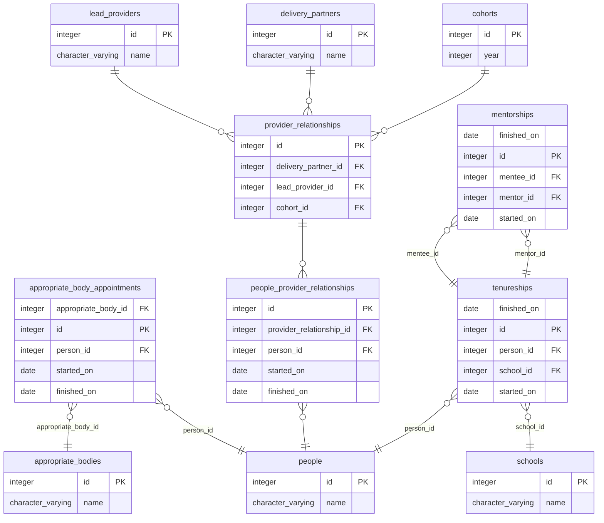

# ECF induction and training record data prototype

This is a prototype demonstrating how we might store both induction records and training records in a way that:

* doesn't duplicate information
* is easy to query
* enables us to query a person's state at any point in time
* allows us to build a picture of their training/induction history

## Reasoning

Given that:
  * an **induction period** requires an ECT to be associated with:
    - an appropriate body
    - a mentor
  * a **induction record** is made from a list of **induction periods**
  * an **training period** requires an ECT to be associated with:
    - a delivery partner and lead provider partnership
    - a mentor
  * a **training record** is made from a list of **training periods**

If we model **training periods** and **induction periods** as records, each
with foreign keys to the things that they depend on, what do incpomplete
periods look like? For example, if a ECT has an appropriate body but no mentor?

We could allow for a nullable `mentorship_id` field, but then it's not _really_
an induction period, so we'd introduce complexity elsewhere in the form of
scopes or functions to filter complete from incomplete periods.

Solving the problems without code is best by every measure, so if we model the
database so the facts are independently stored the resulting solution will
likely be easier to work with.

## Schema

